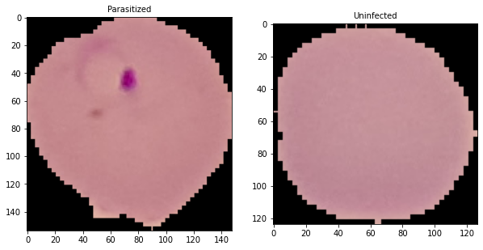

## OVERVIEW
---
This dataset contains a total of 27,558 images of Infected and Parasitized cell images of Malaria.
<br>
Dataset links : [NIH](https://ceb.nlm.nih.gov/repositories/malaria-datasets/) | [kaggle](https://www.kaggle.com/iarunava/cell-images-for-detecting-malaria)<br>
Kaggle Notebook : [here](https://www.kaggle.com/akhilmurali/malaria-cell-detection)

## APPROACH
```python
labels = {
    0: 'Parasitized',
    1: 'Uninfected'
}

plt.subplot(121)
plt.imshow(imread(P_image))
plt.title(labels[int(np.squeeze(model.predict_classes(my_image_P)))])

plt.subplot(122)
plt.imshow(imread(U_image))
plt.title(labels[int(np.squeeze(model.predict_classes(my_image_U)))])

plt.show()
```
<br>
With a CNN, arrived at a training accuracy of 94.4% and validation accuracy of 95.4%.
